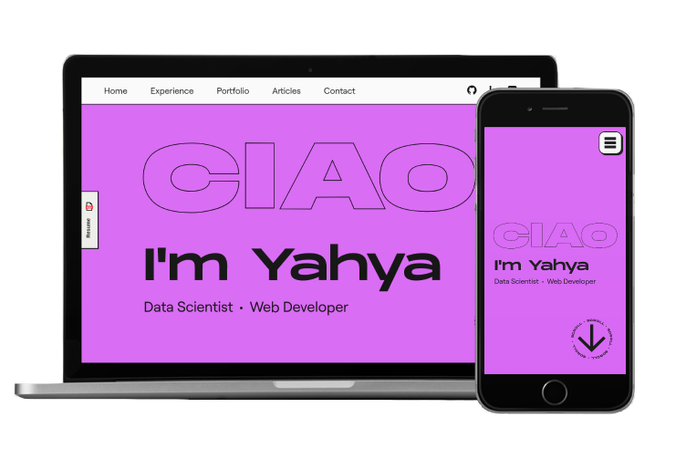

# Personal Website

This is my personal website that I wrote to showcase my work.



## Structure

This is a static website hosted on GitHub Pages. All the styles are located in the `css/` directory and all the JavaScript code is located in the `js/` directory. The assets folder contains the fonts, icons, and images used on this website.

All favicons and the associated `manifest.json` is located in the root directory. Otherwise the browser tries to search for the favicon in the same directory while loading the document, fails to do so, and encounters an _Error 404_ before finally loading the document and requesting the favicon in the correct location.

## Acknowledgements

This project uses the MonumentExtended font:

```txt
This font is free for use in personal projects, client presentations,
and other projects of that nature. These "Free for Personal Use" fonts
cannot be used in commerical projects.
```

This project uses the following icons:

- [GitHub](https://icons8.com/icon/3tC9EQumUAuq/github) icon by [Icons8](https://icons8.com)
- [Medium](https://icons8.com/icon/wYiGNIiB4OKj/medium) icon by [Icons8](https://icons8.com)
- [LinkedIn](https://icons8.com/icon/IuI5Yd3J3qcC/linkedin) icon by [Icons8](https://icons8.com)
